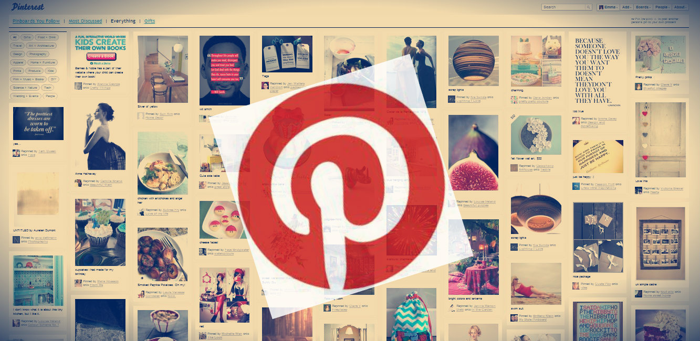

 

## 创立不足1年就估值2亿，这家公司一路开挂拿到12.64亿美元融资，创始人说，我们是一家奇怪的公司。

你知道Facebook、知道Twitter、但是你可能还不知道Pinterest。关于Pinterest，我们暂且称它为一个视觉社交网站。

该网站创办于2010年，而在去年9月份，它的月度总用户数突破一亿大关。同时， Pinterest 在美国本土以外的国际用户也在快速增长，占总用户数的 45%。这个比例与另一款图片社交应用 Instagram 非常相近。

还有一个数据你必须要知道，在《财富》(Fortune)杂志首次发布于2015年1月22日的《全球独角兽名单》中，Pinterest的估值已经超过110亿美元，成为全球最大的视觉社交网站，成立5年，累计融资12.64亿美元。

它的属性有些特别，想知道为什么？看下去。

首先，让我们来看看它究竟是干嘛的：Pinterest采用的是瀑布流的形式展现图片内容，无需用户翻页，新的图片会不断自动加载在页面底端，让用户不断的发现新的图片，Pinterest是瀑布流技术的第一个采用者，目前国内也有很多网站效仿，例如花瓣网。

在Pinterest，用户可以把自己的图片（Pin）钉到板子上（Board），每个板子上都是同一种类型的图片。Pinterest 实际上就是图钉（Pin）与兴趣（interest）的缩写。

在2015年的《财富》科技风暴会上， Pinterest创始人Ben Silbermann回答了关于Pinterest是不是社交网站的问题，他说Pinterest是一个“点子目录”，和社交网络有非常大的差异。二者的目标不同——人们把照片上传到社交网站上是为了让别人喜欢这些照片，在Pinterest，这样做则是为自己服务。

“我们希望别人看到我们网站上的好点子后将其付诸实践。”他把Pinterest比作一本针对用户的“手工编撰目录”。

Pinterest记录的是未来，而不是过去或现在，某种意义上来讲，Pinterest 上所收集的内容正好组合成了一个愿望数据库。这也决定了它不是传统意义上的图片社交。

根据调查人员的研究，Pinterest 给零售网站带去了最多的流量，是 Buzzfeed 等媒体网站上仅次于 Facebook 的信息来源。目前主要的收入是广告业务，2015年6月开始正式试水电商。

我们根据了一些访谈和报道，复盘了这家神奇的创业公司的前世今生。

## 与其改变我们的产品，不如去寻找更多像我这样的人

Pinterest起源于一个小工具。该项目的创意来自于创始人 Ben Silbermann 为他的女朋友寻找订婚戒指之时，他发现了很多还算中意的戒指，但又需要反复比较，于是他就开发了 Pinterest，把它们随手贴在同一个页面上。

另一位创始人Evan Sharp以前是建筑系的，需要接触到很多和建筑有关的内容，由于他的电脑了存了好几个装满图片的文件夹，但这些图片都是数据库自动命名的图片，他觉得很乱。

“Pinterest 给了我创建连接的方式：当我保存一张图片的书签后，以后再去看的时候，我就知道这张图片出自哪里。这张是这个建筑物的，那张是那个建筑物的。Pinterest 的收藏成了管理这种灵感的一种很自然的方式。”

2010 年初，Pinterest 的第一个版本上线，BenSilbermann把它发给了他所有在加州的朋友，但却几乎没有人使用它，倒是他的家乡爱荷华有不少人注册，原因是Ben Silbermann当医生的母亲推荐她的每个病人都去注册。Ben Silbermann只好依靠自己的人脉，亲自联系了数千人推销自己的网站，并询问他们对产品有什么意见。

虽然这种口碑营销费时费力，但却对未来产品改进提供了很大的帮助。上线3个月时，只有3000个用户。不过他们其中一些是活跃用户，他们喜欢这个网站，喜欢上面的所有类别，包括Silbermann自己。

“与其改变我们的产品，不如去寻找更多像我这样的人。”Ben Silbermann说。

## 做了一段时间之后，他们发现这不只是一个图钉

“当你做产品的时候，会想把产品做得更好一点，然后再做好一点，然后再做好一点。伟大的公司，以我来看，就是那些能够创造产品然后在产品上迭代开发的公司。

我不能准确地记得什么时候说出：我的天！图钉不能只是图片。它们代表了一些事情，我们可以让它们更丰富，我们把它们做得更权威一些，添加最好的来源，让创造者依旧拥有自己的版权。”Evan Sharp说。

## 用发现代替搜索

Ben Silbermann喜欢用发现来描述用户在 Pinterest 的行为。“发现指的是去寻找一些意料之外的东西，当你看到它的时候，你就会了解并喜欢上它。”

在过去的很长时间，人们对于互联网的依赖大多是基于搜索。但在现实中零售业大部分是基于发现，而不是搜索。人们在精品店、体验店发现自己喜欢的衣服、鞋子、化妆品，当人们看到这些物品的时候，就知道这些是自己想买的。但“发现”这种体验很难搬到网络上。

在 Pinterest 网站上，人们可以把图片分类收藏，放在不同的钉板上。Ben Silbermann说，收藏是一种人们整理周遭世界的方式，而这种方式反过来体现了你的人格和兴趣。

与此同时，通过关注跟自己兴趣相似的人或者板，可以把有相同兴趣的人聚集在一起。这样会创造一种非常与众不同的“发现”体验。这种体验，会比“搜索”体验更加人性化、立体化和有趣。

Ben Silbermann认为“发现”的时代正在到来。他曾经在一次会议上把谷歌称为“终极卡片目录”，一种过时的技术，只有当用户已经知道自己在寻找什么的情况下才有用。Ben Silbermann表示 Pinterest 的目标是让人们在网络上发现他们喜欢的东西。另一位创始人Evan Sharp则说，Pinterest“把人们从不知道的可能性呈现在他们面前”。

基于这个原理衍生出了“兴趣图谱”（InterestGraph），通过相同的兴趣把人联系在一起，不同于Facebook 的社交图谱（social graph）。Ben Silbermann认为，兴趣图谱未来会比社交图谱更加强大，所覆盖的信息会扩展到更多内容，之前是图片和视频, 未来还会出现音乐和文字。

在 Pinterest 上，人们会经常觉得，这是我想要的东西，这个我可能会喜欢，这是一种非常奇怪的情感状态。Pinterest的联合创始人Evan Sharp对此解释说：“我读过一本摄影的书，它里面讲述了在过去 100 年里照片和视频是如何成为让我们改变生活方式的，Pinterest 只是加速了这个过程。”

以前，因为工具对语言的限制，人们无法搜索不曾想到的东西。

以前，因为工具对语言的限制，人们无法搜索不曾想到的东西。
现在，如果你对一种新事物感兴趣，但是不知道要输入什么，Pinterest 就开始帮你理解语言。

## 商业化之路

Pinterest 对于广告一直都保持着谨慎态度，因为不想失去其忠实度极高的用户群。它在2013年9 月份宣布开始测试广告产品“推广图钉”，品牌商家可以在这种广告模式下购买关键词，从而在搜索结果和新闻流中突显它们的图片，这与 Facebook 的“赞助帖”和 Twitter 的“推广消息”相类似。

结果证明，这类原生广告非常适合手机屏幕，而 Pinterest 的移动端用户比例最高。根据 comScore 的数据显示，超过 90% 的 Pinterest 访问量来自移动端，比 Facebook（68%）和Twitter（86%）都要高。

“用户根本没有把这些图片看做广告”，Pinterest的一位发言人表示。2014年5 月，推广图钉正式上线。很快就吸引了像 Gap、BananaRepublic、Old Navy 和Kraft 等大品牌入驻。依靠这项服务，Pinterest迅速斩获了2400万美元的年收入。

Pinterest在2015年6月推出了第四种图钉服务，即“购买图钉”，用户点击图片上的“购买”键，直接进行支付而无需二次页面转换。除此之外，Pinterest与诸如梅西百货、诺德斯特龙商场等知名线下实体商店达成了合作协议，并推出了折扣提醒，Pinterest集合商城等一系列功能。包括购买图钉在内，众多全新功能的上线让Pinterest在2015年收入超过一亿美元，较2014年增长将近5倍。

## 我们是一家奇怪的公司

很多人将Pinterest于facebook作比较。Evan Sharp以前在 Facebook 工作过。他说Pinterest 给人启发。启发一次不足以产生功能，直到人们开始使用 Pinterest，才会发现这个词的真正意义，Facebook 则是帮助人们进行联系。有人可以给别人带去启发，这根本上来讲也是联系别人。所以我们在数据上有点像 Google，但是在经验上更像 Facebook。而用户在 Pinterest 上“发现”的过程则集合了 Google 和 Facebook。我们不会走聊天应用的路，我们也不会给买家、卖家做一个市场。现在，Pinterest 就是一家奇怪的公司。

## 比起月球，我们更愿意去火星

在一次中国CEO的交流会上，Ben Silbermann谈了自己的人才观，他说：“一般的人才总是去做那些有把握实现的事情，而最好的人才会挑战实现不了的事情。在硅谷，更多的人愿意去火星，而不是去月球，因为去火星难度更大。当是当你把他们聚集在一起，一些不可思议的事情就会发生。”